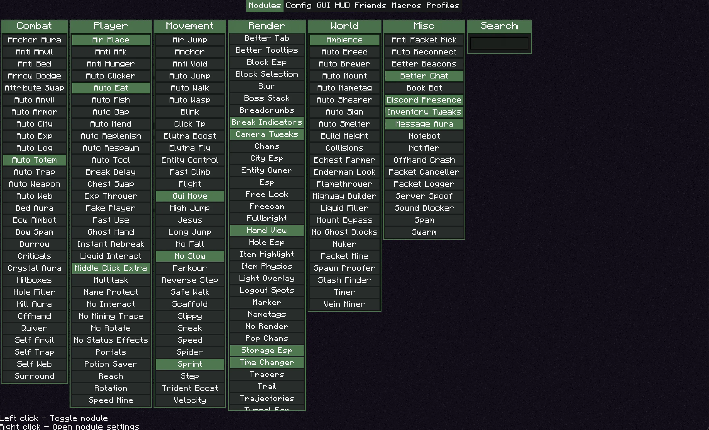
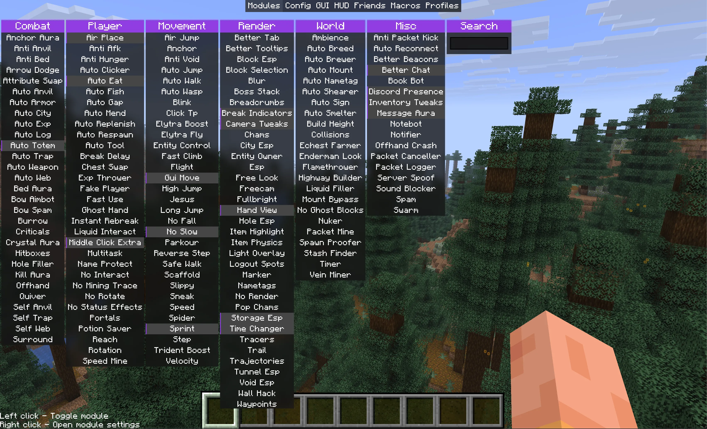

# Exeter Addon for <a href="https://meteorclient.com">Meteor Client</a>

## acknowledgement

Git history is reset but thank you pindour for [catpuccin](https://github.com/X-C-0/Catpuccin-Addon) as that showed me how to create this sorta thing

## With Customization

  

## Without Customization

  

## Installation

> Requires [Meteor Client](https://meteorclient.com) (duh).

1. Go to the [**Releases tab**](../../releases) and download the latest `.jar` file for your Minecraft version.
2. Move the file into your `mods` folder.
3. Launch Minecraft with Meteor Client.
4. Open the **ClickGUI** (`Right Shift` by default).
5. Go to the **"GUI"** tab and select the **"Exeter"** theme from the **"Theme"** dropdown.
6. (Optional) In the **"Config"** tab, set your font to **Arial** or another one that supports multiple font styles (bold, italic...).

##  Features

- Blur + Resolution scaling of whats being blurred
- Module outline
- Module spacing
- Module hover style toggle (meteor/fade)
- Module hover speed settings
- Window outline

## Planned

- Fix bugs cuz there are some

## Support
- Use GitHub issues for bug reports and feature requests

